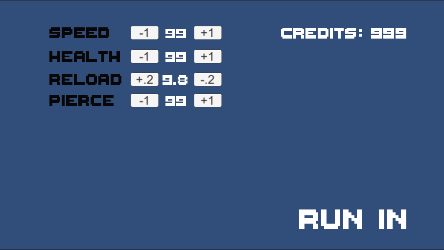

<h2>Rogue-lite-Bullet-Hell-</h2> 
This is a project created to test an idea of creating an arcade game with a slight touch of roguelite aspect of slowly going in and out of a dungeon upgrading your character before each entry into the 'dungeon'. 
<h3>How to view this project</h3>
You can view this project on Unity 2020.3.29f1. Ensure you download this repisitory and in the unity laucher click on add project from disk in the open drop down menu.
<h3> Future plans</h3>
Current plans with the project is for the following:

-  &nbsp; Change the character design from the current placeholder

-  &nbsp; Improve the current enemy spawn system to include unqiue enemys that are more difficult at X amount of spawns or X amount of time to allow for roadblocks for the player to need to improve there high score.
  
-  &nbsp; Add in game sound.
  
-  &nbsp; Create a pause menu and settings.

-  &nbsp; Allow for better modification of the enemy that are not just speed and health. For example, size, color, if they can shoot bullets at the player or not, direction (are they going towards the player or a set path).
  
-  &nbsp; Add in the ability to change your bullet type in the store.
  
<h3> How it was designed</h3>
The idea of how to develop it was by seperating the system in too the two parts. Each time you'd die the player would be sent back to the 'store' page where they would have all their stats and credits reset. Later on, the credits were decided to be equal to the player's current high score. 
From here the plan was to set up a system that could be easily duplicated for any other stat I had in mind or to allow modifications to the bullet type and or player character. 

 
From here on the main page, I wanted to make sure that it was simple to create a new enemy that could randomly be picked to start attacking the player. With this, I was able to check what level it was and then provide a random number that would signify what enemy type. Enemy types were all stored on the player controller.

